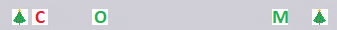

# Что за конец года без выдачи документации?

В это время особенно важно поддерживать коллег-инженеров. Можно отправить всем старое и скучное текстовое сообщение (но даже думать над текстом этого сообщения было бы скучно), а можно придумать что-то необычное и простое, как например шалость с лентой команд. Для этого пришлось расчехлить тяжелую артиллерию: много кнопок на ленте, Paint и пиксель-арт. Некоторые уже догадались: я сделал большое пиксельное "С новым годом!"!

Процесс был одновременно веселым и трогательным, а результат обещал быть очень милым. Если честно, я чувствовал себя цифровым Дедом Морозом, только в руках была мышка, которая ставила пиксели, а не посох, который обычно рисует узоры на окнах. Палитра состояла всего из 4 цветов, которые по очереди применялись к каждой букве, чтобы показать дух праздника (ну и сделать отсылку к гирлянде, конечно). Итогом моего творчества стала такая заготовка, из которой потом были созданы иконки 16x16 пикселей.

И вот во что они превратились в Tekla:

Фон оставил белым по совету супруги, у которой белые рамки ассоциировались с подарочными коробками.

## Неожиданный подарок от Tekla

Но позже шалость получила продолжение! Оказалось, что Tekla отказывается праздновать новый год. Для одного счастливчика (или несчастливчика?) "Новый год" превратился в "Сома":

Изображения для кнопок загрузились не все, поэтому счастливчик смотрел на веселого и странного"Сома". Вероятно это как-то связано с тем, что иконки для команд хранились в сетевом хранилище и к ним обращалось примерно 30 экземпляров Tekla одновременно.

Вот так, даже посреди серьезной работы одна шалость, созданная человеком, может превратиться в другую, которую создает нам программа. А в конце года уже пора расслабляться, принимать неожиданности и помнить - что смех лучшее лекарство, особенно в канун пиксельного нового года!

**Всех с новым годом!**
